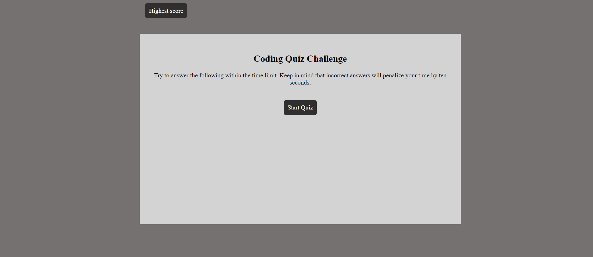
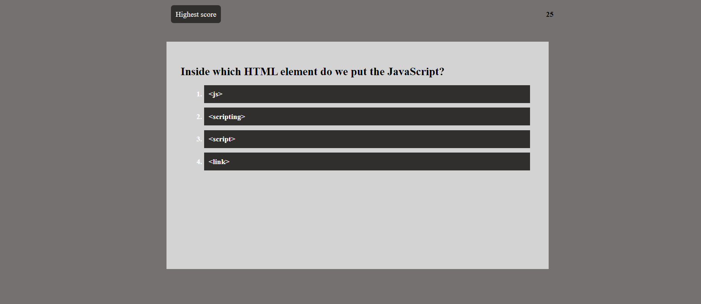
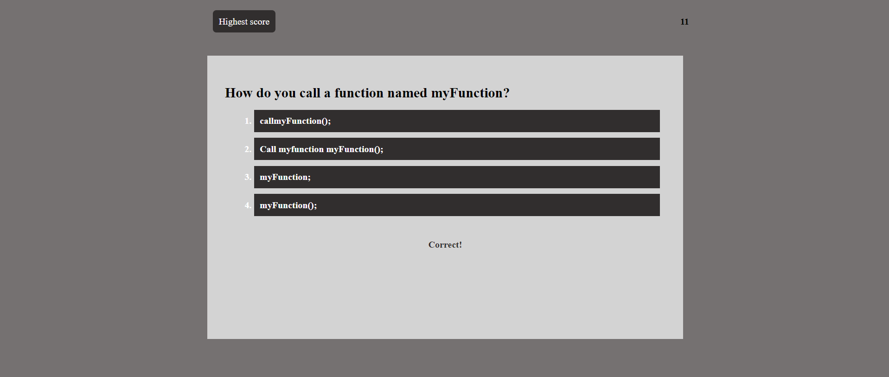

# CodeQuiz

## Description

This week's activity was to build a timed coding quiz with multiple-choice questions.This app will run in the browser and will feature dynamically updated HTML and CSS powered by JavaScript.

## Usage

   
   

Access deployed application here- https://fauziashafi.github.io/landing-page/